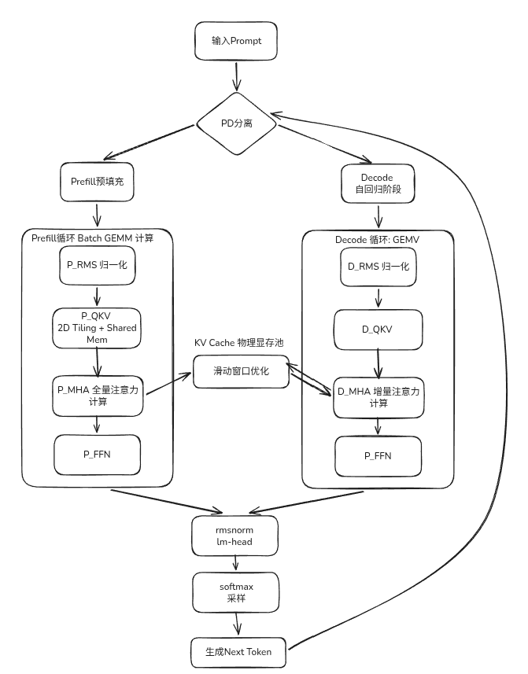
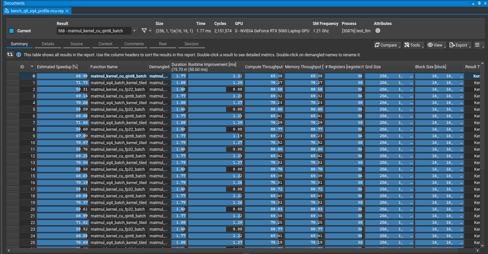
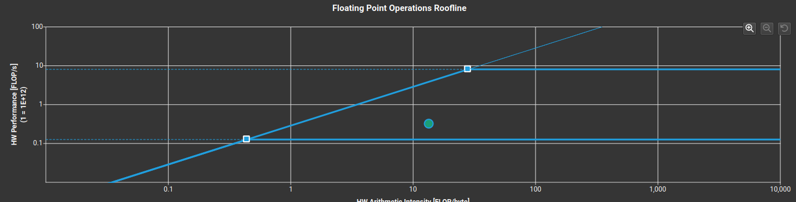
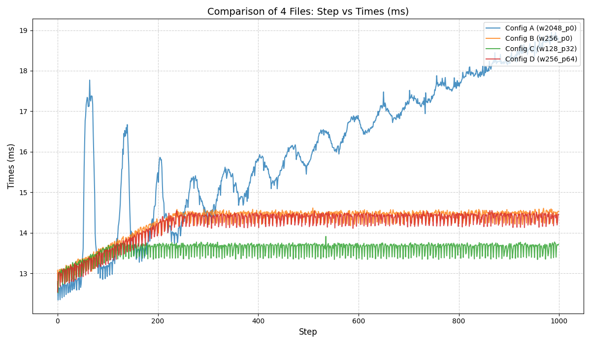

# 框架概述
计并构建了一个高效、灵活且可扩展的深度学习模型推理框架，旨在实现提供快速、准确的模型推理服务。通过优化模型加载和推理流程，大幅提升了处理速度和资源利用效率，能有效支撑多种业务需求。
## 流程图

输入层：文本 → tokenizer 编码为 tokens。

模型层：
- Prefill：将 prompt 前半部分一次性写入 KV cache。
- Decode：逐 token 前向，结合 KV cache 生成 logits。

采样层：从 logits 进行温度、top‑k、top‑p 与重复惩罚采样。

缓存与位置管理：用绝对位置驱动 KV cache，支持滑动窗口与前缀保留。

输出层：生成 token 序列解码为文本，同时记录性能指标。

# 改进
进行的优化：
- PD分离
- 4bit量化
- 滑动窗口

## PD分离
解耦 Prefill与 Decode阶段。将 Prefill 重构为 Batch SGEMM 压榨 SM 吞吐。
以llama1.1b模型为例，在非量化情况下，prefill阶段token数量为17：

| llama1.1b | prefill | Decode Speed  |
| --------- | ------- | ------------- |
| PD分离      | 47.5ms  | 62.1 Tokens/s |
| 不分离       | 93ms    | 62.3 Tokens/s |

进行PD分离后，prefill阶段的速度提升，从访存瓶颈转化为计算瓶颈
### Chunked Prefill
将 prompt tokens 切成固定大小块，每个块依次进行prefill.
对prefill阶段进行了Chunked Prefill的优化。以llama1.1b模型为示例进行了测试：
| llama1.1b | 非chunked  | 128     | 256       | 512     |
| --------- | --------- | ------- | --------- | ------- |
| prefill时间 | 8079.54ms | 8040.82 | 7874.38ms | 8018.73 |
| 显存        | 4.519GB   | 4.517GB | 4.536GB   | 4.556GB |
#### 输出质量
- **Baseline:** 完全崩溃。出现了大量的 `ole`, `phonephony` 等无意义重复，这说明 1783 个 token 一次性计算时，可能由于“采样不稳定/随机性放大/数值波动，导致生成的概率分布变成了噪声。
    
- **Chunks=7 & 4:** 语义开始恢复，虽然还有些奇怪的造词（如 `pleuralisticaly`），但已经能看出在尝试描述系统。
    
- **Chunks=14:** **质量最高**。模型竟然精准地总结出了你的系统特性（“sliding-window attention”, “minimize TTFT”, “chunked prefill”）。

分析：
在该测试条件下观察到，分块越细，单次 Attention 计算中 $QK^T$ 累加的范围越小，浮点数精度损失越小。在 Chunks=14 时，单次计算只有 128 个 token 的关联，这让数值极其稳定， logits 更加平滑，从而让模型“智商回归”。
#### 时间维度

| **模式**                      | **TTFT (ms)** | **评价**                                                                            |
| --------------------------- | ------------- | --------------------------------------------------------------------------------- |
| **Baseline (1 chunk)**      | 8132.8        | **最慢**。大矩阵导致了严重的内存带宽瓶颈和计算单元调度低效。                                                  |
| **Chunks=7** (约 256/chunk)  | 7925.2        | **最快**。                               |
| **Chunks=14** (约 128/chunk) | 8040.8        | **回升**。过多的 Kernel Launch带来的 CPU 启动开销开始反超计算节省的时间。 |

结论： 并非分块越细越好。你的优化版算子在 $256 \times M$ 的规模下能更好地隐藏访存延迟。

#### 显存占用

| **模式**    | **Peak Memory (GB)** |
| --------- | -------------------- |
| Baseline  | 4.519                |
| Chunks=7  | 4.536                |
| Chunks=14 | 4.571                |

虽然我提前预分配了显存，但是随着分块的增多，显存依然会增加。
分析：
虽然“静态显存”（模型权重和预留的 KV 池）是固定的，但是算子在计算的过程中依旧需要一些临时的全局内存空间。
## 4bit量化
使用SmoothQuant 对模型进行4bit量化。并手写了反量化算子，成功加载了Llama2-7B模型。
首字延迟控制在331.2ms 内，生成阶段达到 16.26 Tokens/s 。

### 各模型性能对比
prefill阶段token数量为17：

|                | prefill | Decode Speed   | 模型大小  | 峰值显存占用 |
| -------------- | ------- | -------------- | ----- | ------ |
| llama1.1b-8bit | 48.3ms  | 71.5 Tokens/s  | 1.4GB | 2.180g |
| llama1.1b      | 47.5ms  | 62.1 Tokens/s  | 4.4GB | 4.924  |
| llama7b-4bit   | 331.2ms   | 15.90 Tokens/s | 4.8GB | 7.438  |

分析：
- 由于decode阶段是访存瓶颈，8bit量化后权重数据减少，因此8int量化的decode速度快
- 由于prefill阶段是计算瓶颈，主要的时间都花在了矩阵乘法本身上，而int8中由于多了反量化操作，导致结果差不多

### 显存占用对比
| 显存          | llama 1.1b 8bit | llama 1.1b | llama7b-4bit |
| ----------- | --------------- | ---------- | ------------ |
| 权重          | 1.356g          | 4.101      | 4.57 GB      |
| k cache     | 0.043           | 0.043      | 1 GB         |
| v cache     | 0.043           | 0.043      | 1 GB         |
| prefill中间计算 | 0.133g          | 0.133      | 0.26 GB      |

### 不同量化算子性能对比

| **NCU 指标 (Metric)**  | **FP32** | **INT8** | **4-bit** |
| -------------------- | ------------- | -------- | --------- |
| **SM % (算力利用率)**     | 80.50         | 69.38    | 70.27     |
| **Memory % (带宽利用率)** | 80.50         | 69.38     | 70.27     |
| **寄存器数/线程**          | 36            | 36       | 38        |
| 时间                   | 1.48ms         | 1.77ms    | 1.80ms     |

### Nsight Compute (NCU) 性能剖析
为了验证 2D Tiling 与 Shared Memory 复用的物理收益，本引擎使用 Nsight Compute 进行了严格的 Profiling。总体数据显示，优化后的 Prefill SGEMM 算子组（FP32, INT8, W4A16）耗时均实现了较大下降。

通过消除全局显存的冗余访问，算子的物理瓶颈已成功从 Memory Bound（显存带宽受限）推演至 Compute Bound（CUDA Cores 算力受限）。

#### Roofline
fp32矩阵乘法算子

通过 NCU 的 Roofline 模型分析，我的算子已经接近了 Ridge Point（脊点），处于斜线右侧。这证明我手写的 Shared Memory 2D Tiling 很大程度消除了全局访存瓶颈（Memory Bound），算子已进入 Compute Bound（算力受限） 状态。

至于未能触碰顶端横线，是因为当前 C++ 内核使用的是标准 CUDA Cores 进行标量 FP32 乘加运算，而 NCU 的横线代表的是 Tensor Cores 的理论峰值。如果要跨越这段垂直距离，必须引入 mma.sync 汇编指令并重构数据对齐格式。基于工程 ROI 考量，这一步我选择交由 vLLM 或 AWQ 官方底层库来实现。

## 滑动窗口
- **痛点：** 传统的标准 KV Cache 随着生成长度的增加，显存占用呈线性爆炸。在受限的 8G 显卡上，长文本生成最终必然指向 OOM（Out of Memory）崩溃。
- **成果：** 通过纯 C++ 手写 **环形缓冲区（Ring Buffer）**，利用指针取前缀固定 + 尾部环形，将 KV Cache 的物理内存占用强行“锁死”。

  - 前缀范围内：位置不变（固定）。
  前缀之外：映射到环形缓冲区（按窗口尾部循环覆盖）。
  这一步是“滑动窗口”的核心。
- **价值：** 彻底打破了硬件显存对上下文长度的物理限制，赋予了模型在端侧不宕机、无限轮次对话的可能性。

### 前缀保护

- **痛点：** 简单粗暴的环形覆盖会导致模型在游标转满一圈后瞬间智商清零，输出无意义乱码。
- **成果：** 在底层引入了 **Attention Sink（静态前缀保护）** 机制。通过保留最初的 64 个 Token 不被覆盖，稳住了输出的结果。对逻辑 token 位置做映射，前缀范围保持绝对位置，窗口尾部使用环形槽位覆盖，从而实现“前缀固定 + 尾部滚动”。
- **价值：** 在完全不修改 RoPE（旋转位置编码）逻辑、不牺牲生成连贯性的前提下，在极小显存里实现了高逻辑性的长文本输出。

### 效果
突破了上下文的限制。并且改善了在 Decode 阶段（典型的访存瓶颈 Memory Bound），随着生成文本变长，GPU 搬运 KV 数据的耗时呈线性恶化，导致模型“越跑越慢”。

截断了 Attention 算子的矩阵乘法边界。在实测中，对比 2048 的全量窗口（61.89 steps/s），128 的极限小窗口将 Decode 吞吐率暴力拉升了 **18%**（达到 72.89 steps/s）。

同时更短的窗口和比较小的前缀保护会到导致文本重复出现的情况，对比而言，滑动窗口256，前缀保护64个token的表现上更优。

